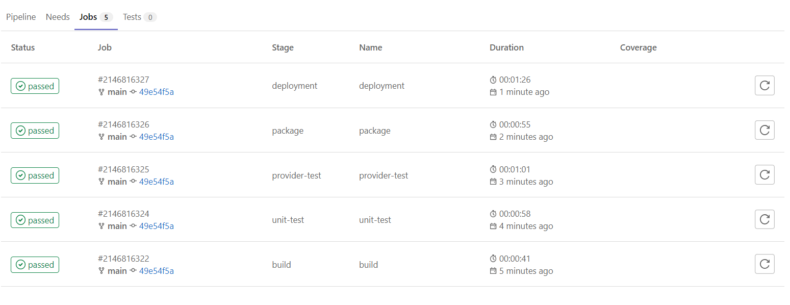
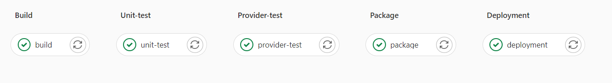

# ToDoList_Backend

Backend of the To Do List Application
## To Do List
- [x] 1- User interface for ONLY adding ToDo’s
- [x] 2- Back-end service to store a persistent state of ToDo list
- [x] 3- Writing deployment files of  front-end and back-end
- [x] 4- Automation buil-test-deployment via Gitlab CI/CD pipeline
- [x] 5- Dockerize
- [x] 6- Deploy application Heroku
- [x] 7- Write deployment configuration

## Test Stack For Back-End

###GoLang (backend)
<ol>
<li>standart library (web framework)</li>
<li>testify (test framework)</li>
<li>map for in-memory database</li>
</ol>

###Gitlab(CI_CD) .gitlab.ci.yml
<ol>
<li>Build(web framework)</li>
<li>UnitTest(test framework)</li>
<li>Provider Test</li>
<li>Package</li>
<li>Deployment</li>
</ol>

## Pipeline Layout

